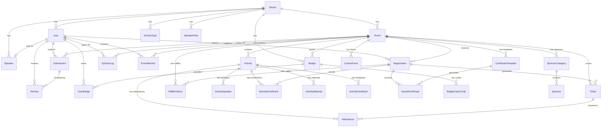

# Banco de Dados — EventHub

Este documento descreve o schema completo do banco de dados do EventHub, suas entidades, relacionamentos e convenções.

---

## Tecnologia

| Item | Detalhes |
|------|----------|
| **SGBD** | PostgreSQL 16 Alpine |
| **ORM** | Prisma 7.6 |
| **Adapter** | `@prisma/adapter-pg` (driver nativo) |
| **Client** | Gerado em `backend/src/generated/prisma/` |
| **Migrations** | `prisma migrate dev` |
| **Seed** | `ts-node prisma/seed.ts` |

---

## Diagrama de Entidades e Relacionamentos (ER)

---

## Tabelas e Campos

### Enums do Sistema

| Enum | Valores |
|------|---------|
| **UserRole** | `ORGANIZER`, `REVIEWER`, `SPEAKER`, `PARTICIPANT` |
| **EventStatus** | `DRAFT`, `PUBLISHED`, `ARCHIVED` |
| **TicketType** | `FREE`, `PAID` |
| **TicketStatus** | `PENDING`, `COMPLETED`, `CANCELLED` |
| **SubmissionStatus** | `SUBMITTED`, `UNDER_REVIEW`, `ACCEPTED`, `REJECTED` |
| **EnrollmentStatus** | `PENDING`, `CONFIRMED`, `CANCELLED` |
| **ActivityStatus** | `SCHEDULED`, `CANCELLED`, `COMPLETED` |
| **FormType** | `REGISTRATION`, `SUBMISSION` |
| **FormFieldType** | `TEXT`, `TEXTAREA`, `SELECT`, `MULTISELECT`, `CHECKBOX`, `DATE`, `NUMBER`, `EMAIL` |
| **ReviewRecommendation** | `STRONG_ACCEPT` → `STRONG_REJECT` (7 níveis) |
| **RaffleRule** | `ALL_REGISTERED`, `ONLY_CHECKED_IN` |
| **BadgeTrigger** | `MANUAL`, `RAFFLE_WINNER`, `EARLY_BIRD`, `CHECKIN_STREAK`, `ACTIVITY_HOURS`, `EVENT_COUNT`, `PROFILE_COMPLETED` |
| **ManualDeliveryMode** | `SCAN`, `UNIQUE_CODES`, `GLOBAL_CODE` |
| **SponsorSize** | `SMALL`, `MEDIUM`, `LARGE` |
| **InvitationStatus** | `PENDING`, `ACCEPTED`, `REJECTED`, `EXPIRED` |

---

### Entidades Principais

#### Tenant
Representa uma organização (instituição, empresa) que gerencia eventos.

| Campo | Tipo | Descrição |
|-------|------|-----------|
| id | `cuid()` | Identificador único |
| name | `String` | Nome da organização |
| logoUrl | `String?` | Logo da organização (via MinIO) |
| coverUrl | `String?` | Banner/Capa da organização (via MinIO) |
| themeConfig | `Json?` | Configuração visual (cores, etc.) |

#### User
Usuário do sistema. Cada usuário pertence a um tenant.

| Campo | Tipo | Descrição |
|-------|------|-----------|
| id | `cuid()` | Identificador único |
| email | `String @unique` | E-mail (login) |
| password | `String` | Hash Argon2 da senha |
| name | `String` | Nome completo |
| role | `UserRole` | Papel no sistema |
| avatarUrl | `String?` | URL do avatar |
| bio | `String?` | Biografia |
| username | `String? @unique` | Nome de usuário (perfil público) |
| publicProfile | `Boolean` | Perfil público visível |
| xp | `Int (default: 0)` | Pontos de experiência |
| coins | `Int (default: 0)` | Moedas (futuro) |
| level | `Int (default: 1)` | Nível de gamificação |
| interests | `String[]` | Áreas de interesse |
| profileTheme | `String?` | Tema visual do perfil |
| mustChangePassword | `Boolean` | Flag de troca forçada de senha |
| refreshToken | `String?` | Token de refresh ativo |

#### Event
Evento gerenciado por um tenant.

| Campo | Tipo | Descrição |
|-------|------|-----------|
| id | `cuid()` | Identificador único |
| tenantId | `String` | FK para Tenant |
| name | `String` | Nome do evento |
| slug | `String` | Slug (único por tenant: `@@unique([tenantId, slug])`) |
| description | `String?` | Descrição |
| location | `String?` | Local |
| startDate / endDate | `DateTime` | Período do evento |
| status | `EventStatus` | Estado atual |
| bannerUrl / logoUrl | `String?` | Imagens do evento |
| themeConfig | `Json?` | Tema visual |
| seoTitle / seoDescription | `String?` | SEO |
| submissionsEnabled | `Boolean` | Módulo de submissões ativo |
| submissionStartDate / submissionEndDate | `DateTime?` | Período de submissão |
| reviewStartDate / reviewEndDate | `DateTime?` | Período de revisão |

#### Activity
Atividade dentro de um evento (palestra, workshop, etc.).

| Campo | Tipo | Descrição |
|-------|------|-----------|
| id | `cuid()` | Identificador |
| eventId | `String` | FK para Event (cascade) |
| title | `String` | Título |
| description | `String?` | Descrição |
| location | `String?` | Sala/local |
| startAt / endAt | `DateTime` | Horário |
| capacity | `Int?` | Vagas (null = ilimitado) |
| status | `ActivityStatus` | Estado |
| typeId | `String?` | FK para ActivityType |
| requiresEnrollment | `Boolean` | Requer inscrição prévia |
| requiresConfirmation | `Boolean` | Requer confirmação |
| confirmationDays | `Int?` | Prazo para confirmação |

#### Registration
Inscrição de um usuário em um evento.

| Campo | Tipo | Descrição |
|-------|------|-----------|
| id | `cuid()` | Identificador |
| eventId | `String` | FK para Event |
| userId | `String` | FK para User |
| createdAt | `DateTime` | Data da inscrição |

#### Ticket
Ingresso gerado após inscrição.

| Campo | Tipo | Descrição |
|-------|------|-----------|
| id | `cuid()` | Identificador |
| eventId | `String` | FK para Event |
| registrationId | `String` | FK para Registration |
| type | `TicketType` | FREE ou PAID |
| status | `TicketStatus` | PENDING, COMPLETED, CANCELLED |
| price | `Decimal` | Valor (default: 0) |
| qrCodeToken | `String? @unique` | Token do QR Code |

#### Attendance
Registro de presença (check-in).

| Campo | Tipo | Descrição |
|-------|------|-----------|
| id | `cuid()` | Identificador |
| ticketId | `String` | FK para Ticket |
| activityId | `String?` | FK para Activity (null = check-in geral) |
| checkedAt | `DateTime` | Momento do check-in |

---

### Módulo de Submissões (Trabalhos Científicos)

#### Submission
Trabalho submetido por um participante.

| Campo | Tipo | Descrição |
|-------|------|-----------|
| title | `String` | Título do trabalho |
| abstract | `String?` | Resumo |
| fileUrl | `String` | URL do arquivo |
| status | `SubmissionStatus` | Estado da submissão |
| modalityId | `String?` | FK para SubmissionModality |
| thematicAreaId | `String?` | FK para ThematicArea |

#### Review
Avaliação de um trabalho por um revisor.

| Campo | Tipo | Descrição |
|-------|------|-----------|
| score | `Int?` | Nota |
| recommendation | `ReviewRecommendation?` | Recomendação (7 níveis) |
| comments | `String?` | Comentários |

#### Entidades auxiliares de submissão:
- **SubmissionModality**: Modalidades de trabalho por evento
- **ThematicArea**: Áreas temáticas por evento
- **SubmissionRule**: Regras/normas (com arquivo PDF)
- **EventReviewer**: Revisores designados para um evento
- **ReviewerInvitation**: Convites para revisores (com token + expiração)

---

### Módulo de Gamificação

#### XpGainLog
Registro de cada ganho de XP.

| Campo | Tipo | Descrição |
|-------|------|-----------|
| userId | `String` | Quem ganhou |
| eventId | `String?` | Em qual evento |
| amount | `Int` | Quantidade de XP |
| reason | `String` | Motivo (`EVENT_CHECKIN`, `ACTIVITY_CHECKIN`, `PROFILE_COMPLETED`, ...) |
| uniqueKey | `String?` | Chave única para evitar duplicatas (`EVENT_CHECKIN_{eventId}`, `ACTIVITY_CHECKIN_{activityId}`, `PROFILE_COMPLETED`) |

**Constraints**: `@@unique([userId, uniqueKey])` — previne XP farming. Ver
[gamificacao.md](gamificacao.md) e [gamificacao-testes.md](gamificacao-testes.md).

#### GamificationAlert
Alertas de comportamento suspeito.

| Campo | Tipo | Descrição |
|-------|------|-----------|
| type | `String` | Tipo do alerta (e.g., `XP_SPIKE`) |
| message | `String` | Descrição |
| metadata | `Json?` | Dados adicionais |
| resolved | `Boolean` | Se foi resolvido |

**Trigger**: Criado automaticamente quando um usuário ganha ≥1000 XP em 5 minutos.

#### Badge / UserBadge / BadgeClaimCode
Sistema de conquistas com múltiplos triggers e modos de entrega.

---

### Módulo de Certificados

| Entidade | Descrição |
|----------|-----------|
| **CertificateTemplate** | Template com background e layout JSON |
| **IssuedCertificate** | Certificado emitido com hash de validação |

---

### Módulo de Patrocinadores

| Entidade | Descrição |
|----------|-----------|
| **SponsorCategory** | Categoria com cor e ordem (e.g., Ouro, Prata) |
| **Sponsor** | Patrocinador com logo e website |

---

### Outros

| Entidade | Descrição |
|----------|-----------|
| **CustomForm** | Formulário dinâmico (REGISTRATION ou SUBMISSION) |
| **CustomFormField** | Campo do formulário (8 tipos) |
| **CustomFormResponse** / **CustomFormAnswer** | Respostas |
| **RaffleHistory** | Histórico de sorteios |
| **ActivityMaterial** | Materiais de apoio (slides, PDFs) |
| **ActivityFeedback** | Avaliações de atividades (1-5 + comentário) |
| **EventMonitor** | Monitores designados para check-in |

---

## Seed (Dados Iniciais)

O script `prisma/seed.ts` cria:

| Dado | Detalhes |
|------|----------|
| **1 Tenant** | "EventHub HQ" (slug: `eventhub-hq`) |
| **4 Usuários** | admin, organizador, participante, revisor (senha: `123456`) |
| **1 Tipo de Atividade** | "Palestra" |
| **1 Papel de Speaker** | "Palestrante" |
| **1 Evento** | "Summit Tecnológico 2026" (10-12/Out/2026, PUBLISHED) |
| **1 Atividade** | "Abertura: O Futuro da IA" (500 vagas) |
| **9 Speakers** | Com avatares e bios |

### Credenciais de Teste

| E-mail | Role | Senha |
|--------|------|-------|
| `admin@eventhub.com.br` | ORGANIZER | `123456` |
| `organizador@eventhub.com.br` | ORGANIZER | `123456` |
| `participante@eventhub.com.br` | PARTICIPANT | `123456` |
| `revisor@eventhub.com.br` | REVIEWER | `123456` |

---

## Índices e Constraints

| Tabela | Constraint | Tipo |
|--------|------------|------|
| Event | `(tenantId, slug)` | `@@unique` |
| ActivityType | `(tenantId, name)` | `@@unique` |
| SpeakerRole | `(tenantId, name)` | `@@unique` |
| EventReviewer | `(eventId, userId)` | `@@unique` |
| ReviewerInvitation | `(eventId, email)` | `@@unique` |
| SubmissionModality | `(eventId, name)` | `@@unique` |
| ThematicArea | `(eventId, name)` | `@@unique` |
| EventMonitor | `(eventId, userId)` | `@@unique` |
| UserBadge | `(userId, badgeId, eventId)` | `@@unique` |
| XpGainLog | `(userId, uniqueKey)` | `@@unique` |
| XpGainLog | `(userId, createdAt)`, `(eventId, createdAt)` | `@@index` |
| BadgeClaimCode | `(badgeId)`, `(code)` | `@@index` |
| GamificationAlert | `(eventId, createdAt)` | `@@index` |

---

## Relacionamentos com Cascade Delete

As seguintes entidades são deletadas em cascata quando o pai é removido:

- `Event` → Activities, Registrations, Tickets, Forms, Submissions, CertificateTemplates, SponsorCategories, Badges, etc.
- `Activity` → ActivitySpeaker, ActivityEnrollment, Attendance, ActivityMaterial, ActivityFeedback
- `Registration` → Tickets, Enrollments, FormResponses, Certificates
- `Ticket` → Attendance
